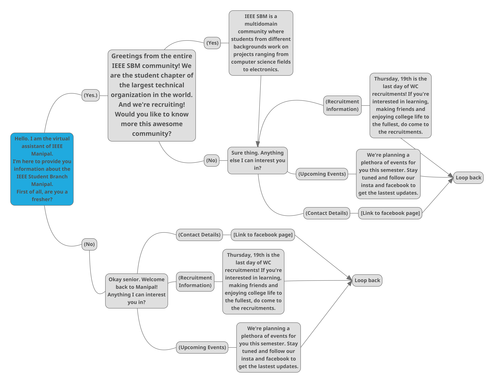

# IEEE SBM Action

This is the IEEE Manipal Google Assistant codebase. Build using Node-js and DialogFlow.

### **Installation**

- Create a new Google Action
- Download the agent .zip file present in Agent/ directory
- Go to settings, choose 'Import from .zip' and import the downloaded agent
- Clone the repo and open in your fav editor (VS Code etc)
- Link it to your Firebase account
- Deploy it using the command line arguments given in the Google Codelabs

### **Mind Map Representation**

